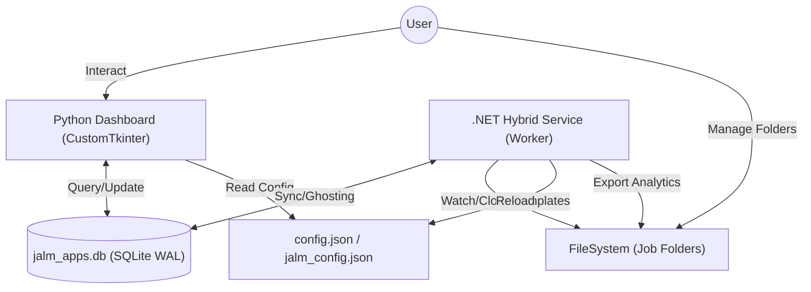

# JALM Technical Documentation

This document provides a detailed overview of the Job Application Lifecycle Manager (JALM) architecture, data models, and core logic.

## 🏗️ Project Architecture

JALM now operates as a **Hybrid Intelligence System** where a Python frontend and a .NET background service work in tandem via a shared database and filesystem.



### Component Structure
```text
Job Application Lifecycle Manager/
├── JALM.Service/       # .NET 8.0 Background Service (C#)
│   ├── SmartWatcher.cs     # Real-time folder monitoring
│   ├── DocumentService.cs # Automated CV/Cover Letter generation
│   ├── AnalyticsService.cs # Background metrics & CSV export
│   └── ConfigService.cs    # Hot-reloading configuration logic
├── app/                # Python Desktop Application (Python)
│   ├── core/               # UI-specific business logic
│   │   ├── config_mgr.py   # Configuration loader
│   │   ├── database.py     # SQLite wrapper & Status-Aware Analytics
│   │   ├── file_ops.py     # Filesystem I/O & Status Discovery
│   │   ├── service_mgr.py  # .NET Service Lifecycle Manager
│   │   └── batch_export.py # Batch file discovery & renaming logic
│   ├── gui/                # Dashboard and Setup components
│   │   ├── dashboard.py    # Main UI & Scan/Reload Orchestrator
│   │   ├── analytics_view.py # Charting & Reporting Window
│   │   ├── add_app_dialog.py # New Application Input Modal
│   │   ├── calendar_dialog.py # Custom Date Picker
│   │   ├── interview_manager.py # Interview Notes Modal
│   │   ├── setup_wizard.py # Initial Configuration Wizard
│   │   ├── export_dialog.py # Selective export configuration
│   │   └── report_dialog.py # Detailed analytics drill-down
│   └── utils/              # UI helper utilities
│       └── tooltip.py      # Hover tooltip widget
├── config.json         # Shared global state
└── [Your Root Directory]/
    ├── jalm_config.json    # Workspace templates & User info
    ├── jalm_apps.db        # Shared SQLite database
    ├── analytics.json      # Pre-calculated background metrics
    └── applications_export.csv # Dynamic data dump
```

## 🗄️ Database Schema

JALM uses SQLite for persistent storage.

### Table: `applications`
Stores the high-level metadata for each job application.

| Column | Type | Description |
| :--- | :--- | :--- |
| `id` | INTEGER | Primary Key. |
| `company_name` | TEXT | Name of the company. |
| `role_name` | TEXT | Specific job title. |
| `folder_path` | TEXT | Absolute path to the role folder. |
| `status` | TEXT | Applied, Interviewing, Rejected, Offer, Ghosted. |
| `job_description` | TEXT | Full text of the job post (stored in DB and `.txt`). |
| `created_at` | DATETIME | Timestamp of entry creation. |

### Table: `interviews`
Stores notes related to specific interview rounds.

| Column | Type | Description |
| :--- | :--- | :--- |
| `id` | INTEGER | Primary Key. |
| `app_id` | INTEGER | Foreign Key referencing `applications.id`. |
| `sequence` | INTEGER | The interview number (1, 2, 3, etc.). |
| `notes` | TEXT | Interview details and feedback. |
| `date` | DATETIME | Timestamp of interview log. |

## ⚙️ Core Modules

### Configuration Management (`config_mgr.py`)
JALM uses a two-tier configuration system:
- **Global Config (`config.json`)**: Stored in the app root, it only tracks the `active_root` path.
- **Workspace Config (`jalm_config.json`)**: Stored *inside* each Applications Root folder. It manages CV/Cover Letter template paths specific to that workspace, including:
    - `cv_template_path`: The default CV template.
    - `cover_letter_template_path`: The default Cover Letter template.
    - `additional_cv_templates`: A dictionary for role-specific templates (e.g., `{"Data Analyst": "C:/path/to/DA_CV.docx"}`).

### Database Management (`database.py`)
JALM implements **Workspace Isolation**. Each "Applications Root" contains its own `jalm_apps.db`. Switching the root directory in the UI dynamically rebinds the database connection to the new workspace's DB file.

### Concurrency Model (WAL)
To support two high-speed processes accessing the same SQLite database, JALM enforces **Write-Ahead Logging (WAL)**.
- **Python side**: Configured in `app/core/database.py` with `PRAGMA journal_mode=WAL`.
- **.NET side**: Configured in `DatabaseService.cs` with `PRAGMA busy_timeout=5000` to handle brief write locks during sync.

### Hybrid Sync Logic
1.  **SmartWatcher (.NET)**: Monitors the workspace at Depth 2 (`Company/Role`). It uses a **500ms debounce** to ensure that folder renames (e.g., from "New Folder") are finalized before syncing to the DB.
2.  **Auto-Refresh (Python)**: The UI polls the database count every 10 seconds. It only triggers a full re-render if the count has changed, ensuring background syncs appear instantly without disrupting user search.
3.  **Status Discovery (Python)**:
    - During a **"Scan & Reload"**, JALM inspects application folders for evidence of progress (e.g., existing `interviews.txt` files).
    - **Automatic Promotion**: If an application is marked as 'Applied' but interview notes are found on disk, the system automatically promotes the status to **'Interviewed'**.
    - This ensures that manual file operations or external edits are correctly reflected in the application lifecycle state.

### Automated Document Generation
The `.NET` service handles document preparation headlessly:
- **CV/Cover Letter cloning**: Triggered instantly on folder creation. Use the Python UI's dropdown to override the default CV template with a role-specific alternative.
- **Date Replacement**: In the Cover Letter, the service scans for the `{Date}` placeholder and injects the current date in a professional format (`10, January 2026`).
- **Nomenclature**: Strictly follows the `[UserName]_[Type]_[RoleName].docx` convention for consistent professional branding.

### Persistent Application Data
To ensure your job data is human-readable outside of JALM, the system also mirrors key information to plain text files:
- **`job_description.txt`**: Created during the initial "Add Application" step.
- **`interviews.txt`**: A chronological log of all interview rounds. Each new note is appended with a sequence header and timestamp.

### Analytics Engine
Calculated in the background to keep the UI snappy:
- **Ghosting Detection**: Applications with status `Applied` and no activity for > 30 days are flagged.
- **Data Export**: Periodically dumps the entire database state into `applications_export.csv` for advanced tracking in spreadsheet software.

### Performance Optimizations
- **Virtual Rendering & Limit**: Shows only the 20 most recent applications by default. The "Show All" toggle enables a chunk-based renderer (`_render_chunk`) that populates the list in small batches (30 items at 20ms intervals) to maintain UI responsiveness.
- **Search Optimization**: Queries are triggered manually via the "Search" button or "Enter" key, reducing unnecessary database load compared to live-filtering.
- **Interactive Headers**: Dynamic sorting with visual indicators (↑/↓) using SQL `ORDER BY` on indexed columns.
- **Throttled Resize**: Window `<Configure>` events are throttled, pausing rendering during active dragging to eliminate lag.

### Analytics Visualization (`analytics_view.py`)
- **Matplotlib Integration**: Uses `FigureCanvasTkAgg` to embed Matplotlib charts directly into the CustomTkinter window.
- **Custom Tooltips**: Implements a manual event handler (`motion_notify_event`) to display data annotations when hovering over chart elements (wedges/bars), as `mplcursors` is not used.
- **Calendar Dialog**: A custom `CTkToplevel` popup (`calendar_dialog.py`) providing a month-view date picker, replacing heavy external dependencies like `tkcalendar`.
- **Advanced Reporting**: Features a **"View Report"** function that triggers a modal (`report_dialog.py`). This view calculates an application-to-interview **Success Rate** for any chosen date range.

### Batch Document Export (`batch_export.py`)
Provides a robust utility for gathering documents for external use or audits:
- **Heuristic File Matching**: Uses keyword-based searches ("CV", "Resume", "JD", "Description") and file extension prioritization (.pdf, .docx) to find relevant job files inside user folders.
- **Sequential Renaming**: Prevents naming collisions by appending indices based on document type (e.g., `Engineer cv 1.pdf`, `Engineer cv 2.pdf`).
- **Conflict Management**: If the user selects a non-empty directory, JALM generates a unique subfolder (e.g., `Export_20260124_221005`) to prevent data mixing.

## 🎨 UI Framework

The application is built using `CustomTkinter`, a wrapper around `tkinter` that provides a modern, high-DPI compatible interface.

- **SetupWizard**: A modal window for initial configuration.
- **Dashboard**: The primary interface, utilizing `CTkScrollableFrame` for the application list.
- **ToolTip**: A custom utility in `app/utils` that provides hover-based information for truncated text.

## 🛠️ Error Handling

- **Folder Integrity**: The `AppListItem` provides visual feedback (red text) if a folder is missing.
- **Self-Cleaning & Syncing Database**: The "Scan & Reload" feature allows users to prune the database of broken records and force-sync application dates with the original folder creation time.
- **Database Safety**: Uses SQLite's `ON DELETE CASCADE` to ensure that removing a broken application record also cleans up its associated interview logs.
