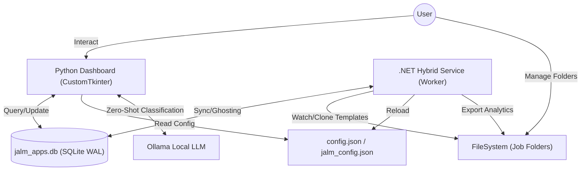

# Job Application Lifecycle Manager (JALM)

JALM is a powerful desktop application designed to streamline and automate your job search process. Built with Python and `CustomTkinter`, it provides a sleek, modern interface for managing applications, automating folder organization, and tracking interview progress.

## 🚀 Features

- **Independent & Portable Workspaces**: Every root folder becomes its own independent workspace. Settings and databases are stored *within* your chosen root, making your job data fully portable.
- **Hybrid Intelligence Service (.NET)**: A high-performance background service that handles heavy lifting like real-time syncing, document automation, and analytics.
- **Real-Time Folder Sync**: Automatically detects when you create, rename, or delete folders in your workspace and syncs them to the database instantly with smart debouncing.
- **Automated Document Generation**: Headlessly clones your CV and Cover Letter templates into new application folders. It automatically updates the date in your Cover Letter (e.g., "10, January 2026").
- **Multiple CV Templates**: Manage different CV versions (e.g., Data Engineer vs. Data Analyst) in Settings and select the most relevant one when adding a new application.
- **Live Analytics & Export**:
    - **Ghosting Tracking**: Automatically flags applications with no activity for > 30 days.
    - **CSV Export**: Periodically generates a full `applications_export.csv` for use in Excel/Sheets.
    - **Persistent Job Data**: Saves Job Descriptions and Interview Notes as professional `.txt` files directly in each application folder (`job_description.txt` and `interviews.txt`).
    - **Auto-Refresh UI**: The Python dashboard intelligently reloads when it detects background database changes.
- **Advanced Analytics Dashboard**:
    - **AI-Powered Role Categorization**: Integrates with a local LLM (Ollama, `llama3.2` by default) to automatically organize highly varied or messy job titles (e.g., "Junior Web Developer", "SWE") into standardized, clean professional buckets (e.g., "Software Engineer"). 
        - Uses a persistent SQLite cache (`role_mappings` table) so API calls are instantaneous after the first run.
        - Includes an interactive **Role Classification Manager** UI to review AI decisions, manually override them, change the active LLM model, or clear the cache to force a re-evaluation of all data.
    - **Visual Timeline**: Stacked bar charts showing application history (Applied vs. OA vs. HR Call vs. Interviewed vs. Offer).
    - **Status Distribution**: Interactive pie charts with hover tooltips and a continuous date-padded timeline.
    - **Detailed Funnel Reporting**: Generate a comprehensive **Summary Report** with segmented tracking for **OA**, **HR Call**, and **Interview** stages.
    - **Performance Metrics**: Calculates a professional **Success Rate** based on your Interview-to-Offer conversion performance.
    - **Quick Filters**: "Last 7 Days", "Last 14 Days", "Last 30 Days", and one-click **"Year-To-Date (YTD)"** shortcuts using a theme-aware custom Calendar picker.
- **Batch Document Export**:
    - **Selective Backup**: Bulk-export your CVs, JDs, or both for your current search results.
    - **Standardized Renaming**: Automatically renames files for professional organization (e.g., `JobTitle cv 1.pdf`, `JobTitle jd 1.txt`).
    - **Smart Collisions**: Automatically creates timestamped subfolders if exporting to a non-empty directory.
- **Smart Indexing**: Intelligently handles multiple applications to the same company/role by automatically adding sequential indices (e.g., "Software Engineer (2)").
- **High Performance**:
    - **Asynchronous Processing**: Background threads execute AI operations or heavy data fetches so the GUI never hangs.
    - **Limit & Toggle**: Shows most recent 20 applications by default for instant loading, with a "Show All" toggle for full history.
    - **Optimized Search & Filtering**: Filter by company or role using the debounced search bar (supports Enter key) and quickly filter by time ("7 Days", "30 Days") using the built-in dropdown.
    - **Database Indexing**: Optimized SQLite queries inside each workspace.
- **Interactive Sorting**: Click on **Company** or **Date** headers to toggle sort order (↑/↓) for quick organization.
- **Sleek UI**:
    - **Visual Status**: Color-coded buttons (Green for Offer, Purple for Interviewing, Red for Rejected).
    - **Context Actions**: Right-click to delete records safely.
    - **Dark-Themed**: Modern CustomTkinter design.

## 🛠️ Installation

1. **Prerequisites**:
   - **Python 3.8+**
   - **.NET 8.0 SDK**
   - **[Ollama](https://ollama.com/)** (Required for AI categorization). After installing, pull the default model:
     ```bash
     ollama pull llama3.2
     ```

2. **Clone the repository**:
   ```bash
   git clone <repository-url>
   cd "Job Application Lifecycle Manager"
   ```

2. **Install dependencies**:
   ```bash
   pip install -r requirements.txt
   ```

3. **Setup the Background Service (.NET)**:
   - Navigate to `JALM.Service/`
   - Build and run the service:
     ```bash
     dotnet run
     ```
   - (Optional) Build a standalone executable:
     ```bash
     dotnet publish -c Release -r win-x64 --self-contained true -p:PublishSingleFile=true
     ```

4. **Run the Dashboard (Python)**:
   ```bash
   python main.py
   ```

5. **Run the Unified Test Suite**:
   ```bash
   python run_tests.py
   ```

## 📖 Usage

### Initial Setup
On the first run, the **Setup Wizard** will appear. You will need to select:
1. **Your Full Name**: Used for professional naming of CV and Cover Letter templates.
2. **Applications Root Folder**: Where all your job folders will be stored or where they currently exist.
3. **CV Template**: A `.docx` file to be used as a template for new applications.
4. **Cover Letter Template**: A `.docx` file to be used as a template for cover letters.

### Managing Applications
- **Search & Filter**: Enter text in the search bar and click **Search** or press **Enter** to filter. Click anywhere else to unfocus the search bar, or use the 'x' button to clear it. Use the time filter dropdown next to the "Show All" toggle to view applications from the last 7, 14, 30, or 60 days.
- **Scan & Reload**: Click this to sync your dashboard with your folder structure. It imports new folders and removes "broken" links for folders you've deleted manually.
- **List Limit**: By default, JALM shows the 20 most recent applications. Toggle **Show All** to view your entire history.
- **Sorting**: Click the **Company** or **Date** headers to toggle sort direction.
- **Add Application**: Click `+ Add Application`. Select your preferred **CV Template** from the dropdown, enter company details, and paste the **Job Description**. JALM automatically appends an index if a duplicate role exists in the same company.
- **Open Folder**: Simply **double-click** any row to jump to that application's local directory. (Red text indicates a missing folder).
- **Interviews**: Click the `Interviews` button to log notes for each round. Notes are saved to the database and appended to an `interviews.txt` file in the folder.
- **Batch Export**: Click **Export Results** to copy all CVs and JDs for your currently filtered list into a single folder. You can choose to export only CVs or only JDs using the popup dialog.
- **Switching Workspaces**: Change your **Applications Root** in Settings to instantly load a different database and template set.
- **Workspace Config (`jalm_config.json`)**: Stored *inside* each Applications Root folder. It manages CV/Cover Letter template paths specific to that workspace.

- **Switching Workspaces**: Change your **Applications Root** in Settings to instantly load a different database and template set.
- **Workspace Config (`jalm_config.json`)**: Stored *inside* each Applications Root folder. It manages CV/Cover Letter template paths specific to that workspace.

## 🏗️ System Architecture

JALM operates as a **Hybrid Intelligence System** where a Python frontend and a .NET background service work in tandem via a shared database and filesystem.



## 🗄️ Database Design

JALM uses SQLite with **Write-Ahead Logging (WAL)** enabled to ensure the Python UI and .NET service can read and write concurrently without locking conflicts.

### 1. `applications` Table
Stores the high-level metadata for each job application.
| Column | Type | Description |
| :--- | :--- | :--- |
| `id` | INTEGER | Primary Key. |
| `company_name` | TEXT | Name of the company. |
| `role_name` | TEXT | Specific job title. |
| `folder_path` | TEXT | Absolute path to the role folder. |
| `status` | TEXT | Applied, OA, HR Call, Interviewed, Rejected, Offer, Ghosted. |
| `job_description` | TEXT | Full text of the job post. |
| `created_at` | DATETIME | Timestamp of entry creation. |

### 2. `interviews` Table
Stores historical notes related to specific interview rounds.
| Column | Type | Description |
| :--- | :--- | :--- |
| `id` | INTEGER | Primary Key. |
| `app_id` | INTEGER | Foreign Key referencing `applications.id` (ON DELETE CASCADE). |
| `sequence` | INTEGER | The interview number (1, 2, 3, etc.). |
| `notes` | TEXT | Interview details and feedback. |
| `date` | DATETIME | Timestamp of interview log. |

### 3. `role_mappings` Table (AI Cache)
A high-speed lookup table that permanently caches LLM classification decisions.
| Column | Type | Description |
| :--- | :--- | :--- |
| `original_role` | TEXT | Primary Key. The raw, user-entered job title. |
| `mapped_category` | TEXT | The standardized industry group identified by the AI (e.g., 'Data Engineer'). |

## 💻 Development & Git Workflow

### Git Commands
To keep your project updated on GitHub:
1. **Check Status**: `git status`
2. **Stage Changes**: `git add .`
3. **Commit**: `git commit -m "Your description of changes"`
4. **Push**: `git push origin main`

## 🧪 Testing & Quality Assurance

JALM uses a comprehensive hybrid testing strategy to ensure reliability across both the Python core and the C# background service.

### 1. Unified Test Runner
We provide a one-click script to execute the entire test suite across both stacks and generate a combined report:
```bash
python run_tests.py
```

### 2. Python Backend (`pytest`)
- **Framework**: `pytest` with `pytest-mock` and `pytest-cov`.
- **Target**: Core logic in `app/core/` (Database, Config, LLM, Sync).
- **Current Coverage**: **~77%** (Focusing on backend business logic).
- **Run Separately**:
  ```bash
  pytest --cov=app/core tests/
  ```

### 3. C# Background Service (`xUnit`)
- **Framework**: `xUnit`, `Moq`, and `Microsoft.Data.Sqlite`.
- **Target**: `SmartWatcher`, `AnalyticsService`, `DocumentService`, and `DatabaseService`.
- **Current Coverage**: **~91%** (Core services).
- **Run Separately**:
  ```bash
  dotnet test JALM.Service.Tests/JALM.Service.Tests.csproj
  ```

### 4. Automated Coverage Reports
Every test run generates visual reports:
- **Python**: View `htmlcov/index.html` for line-by-line breakdown.
- **C#**: Generates a `coverage.cobertura.xml` in `TestResults/` for CI/CD integration.

---

### Creating an Executable (.exe)
JALM uses `PyInstaller` to create a standalone Windows executable. 

1. **Install PyInstaller**:
   ```bash
   pip install pyinstaller
   ```

2. **Run Build Script**:
   To ensure all assets, themes, and the background .NET service are bundled correctly, use the provided build script:
   ```bash
   python build_exe.py
   ```

3. **Locate EXE**: Your standalone executable will be generated in the `dist/` folder as `JALM.exe`.

## 📄 Documentation

For detailed technical information, architecture overview, and database schema, please refer to [DOCUMENTATION.md](DOCUMENTATION.md).

## 🤝 Contributing

Contributions are welcome! Feel free to open issues or submit pull requests.

## 📜 License

Created as part of a Personal Project.
